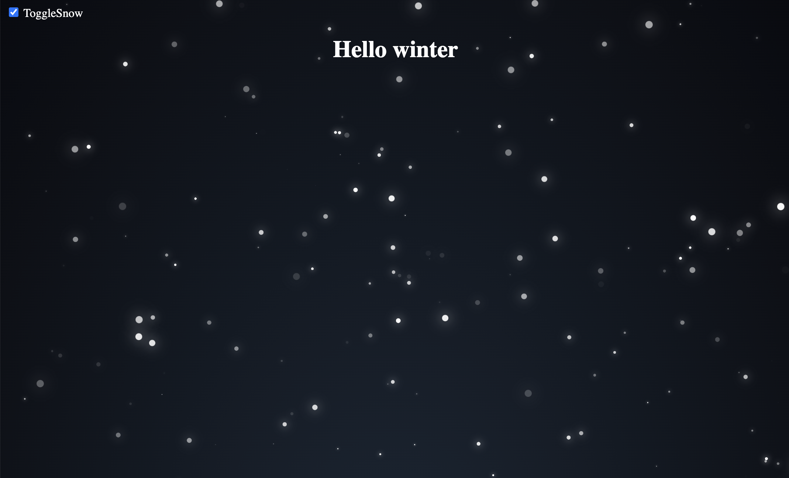

# Project documentation

## Project purpose
This educational website showcases hiking trails worldwide, categorized by the four seasons. Designed to inspire exploration and appreciation for nature, it offers a curated selection of trails suited for all experience levels.

## General project structure
<ul>
  <li>root folder (project folder)</li>
    <ul>
      <li>index.html</li>
      <li>winter.html</li>
      <li>spring.html</li>
      <li>summer.html</li>
      <li>autumn.html</li>
      <li>impressum.html</li>
      <li>css folder</li>
        <ul>
            <li>global.css</li>
            <li>index.css</li>
            <li>winter.css</li>
            <li>spring.css</li>
            <li>summer.css</li>
            <li>autumn.css</li>
            <li>animation.css</li>
            <li>impressum.css</li>
        </ul>
      <li>js folder</li>
        <ul>
            <li>global.js</li>
            <li>index.js</li>
            <li>pure-planet.js</li>
            <li>pure-snow.js</li>
            <li>pure-flower.js</li>
            <li>pure-rainbow.js</li>
            <li>pure-leaf.js</li>
        </ul>
      <li>resources folder</li>
        <ul>
            <li>icons</li>
            <li>images</li>
        </ul>
      <li>.vscode folder</li>
        <ul>
            <li>settings.json</li>
        </ul>
      <li>README.md</li>
      <li>package.json</li>
      <li>LICENSE</li>
      <li>.gitignore</li>
    </ul>
  </li>
</ul>


## Mockups
### Mobile


### Desktop


## Color schemes
### Home
Violet -> Represents spirituality, fantasy and creativity. <br>


### Winter
Blue -> Represents a cold, clean and quiet winter. <br>


### Spring
Green -> Represents growth, natur and a refreshing spring. <br>


### Summer
Orange -> Represents a warm (hot) summer. I first wanted to use a yellow color scheme, but that would not have had a good visibility on the screen, so I decided to use a orange color scheme instead. <br>


### Autumn
Red -> Represents the "dying leaves" (blood) in winter when the plants withdraw their energy and resources into their inner self. <br>


### Impressum
Rainbow theme -> for good mood and LGBTQIA+ support. <br>


## Fonts
I used Sans-Serif fonts because those are easier to read and look cleaner. <br>


## Images
The images are all from Unsplash:
https://unsplash.com/de

## Icons
Some of the icons are from Font Awesome (https://fontawesome.com/) and some are from Flaticon (https://www.flaticon.com/).

## Animations
### The background animation is inspired by hyperstown
https://github.com/hyperstown/pure-snow.js

### In the beginning the animation looked like this


### After the adaptations I did (symbols, height, width, ...), it now looks like this


### The rainbow animation on the impressum page is inspired by:
https://www.youtube.com/watch?v=YG9FyEDGDVM


## Accessibility
<ul>
  <li>Image enlargement</li>
  <li>High contrast</li>
  <li>Sans-Serif fonts</li>
  <li>Responsiveness</li>
</ul>
<br>
<br>

## Containerization
### Build image
```bash
podman image build -f Containerfile -t snow
```

### Run container
```bash
podman run -d -p 8080:5000 localhost/snow
```
Note: Open browser and type localhost:8080 to access the website.
<br>
<br>

## pure-snow.js

A simple JavaScript package that generates snowflakes and corresponding CSS to make them fall on your webpage.

Written in pure JS/CSS. (No SCSS). 

Inspired by: [alphardex](https://codepen.io/alphardex/pen/dyPorwJ) (SCSS Version) and [YusukeNakaya](https://codepen.io/YusukeNakaya/pen/NWPqvWW) (Vue implementation).

pure-snow.js was created for those who don't want to install any additional libraries and want to easily change parameters. \
If you only need the effect I can also recommend downloading compiled version of [alphardex's](https://codepen.io/alphardex/details/dyPorwJ) work. 
It should be render slightly faster.


### Installation

#### npm

To install via npm, run the following command in your terminal:

```bash
npm install pure-snow.js
```

#### Script Tag

To use the script via a script tag, include the following in head of your HTML file:

```html
<link rel="stylesheet" href="/path/to/style.css">
<script src="/path/to/pure-snow.js" defer></script>
```

### Usage

In case you used npm to install the package, generate snowflakes with `generateSnow` function.

```js
// import "pure-snow.js/style.css"; // Remember to import style.css
import { createSnow, showSnow } from "pure-snow.js";

generateSnow(); // creates snowflakes and generate css for them
showSnow(true); // snow can be disabled using showSnow function
```

**NOTE: When used via a script tag, generateSnow will run automatically after document has been loaded.**

Create snow element.

```html
<div id="snow"></div>
```


#### Controlling snowfall density

Default amount of snowflakes is set to 200. This might be challenging for an older GPU. \
You can change that by adding attribute `count` to snow div eg:
```html
<div id="snow" count="200"></div>
```


#### No CSS files whatsoever
It is also possible to get rid of style.css file. Just paste it's content to declaration of const `BASE_CSS` in script above pure-snow.js file eg:

```html
<script>
const BASE_CSS = `
    body {
        background: radial-gradient(ellipse at bottom, #1b2735 0%, #090a0f 100%);
        overflow-x: hidden;
        min-height: 100vh; 
        /* If you want to change the site height you can remove overflow-y */
        /* pure-snow will automatically detect height of body tag */
        overflow-y: hidden;
        color: white;
    }
    
    .snowflake {
        position: absolute;
        width: 10px;
        height: 10px;
        background: white;
        border-radius: 50%;
        filter: drop-shadow(0 0 10px white);
    }
`
</script>
<script src="/path/to/pure-snow.js" defer></script>
```

### Example

Here is a full example of how you might use the `pure-snow.js` in a webpage:

```html
<!DOCTYPE html>
<html>
    <head>
        <meta name="viewport" content="width=device-width, initial-scale=1.0">
        <link rel="stylesheet" href="/path/to/style.css">
        <script src="/path/to/pure-snow.js" defer></script>
        <!-- Generated snowflake styles will be injected here --> 
    </head>
    <body>
        <div id="snow" count="200"></div>
        <!-- Your content goes here --> 
    </body>
</html>
```

### Caveats

#### Page height
Keep in mind that increasing page height might impact performance. 
While increasing page height snowflake count should also be increased.

For example:

Page `height:100vh` ---> `count = 200`

Page `height:200vh` ---> `count = 300`


### Demo
https://hyperstown.github.io/puresnowjs/


### License

This project is licensed under the MIT License. See the LICENSE file for more details.